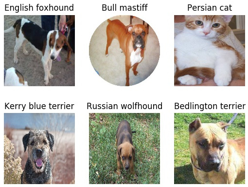

# Image Classification Module
This is a demonstration of image classification performed using Inception V3 classification module. No training has been performed in this sample and direct inference obtained using Inception V3 model trained on ImageNet 1000 classes is used.

Download the data from [Kaggle's dog-cat classification](https://www.kaggle.com/c/dogs-vs-cats-redux-kernels-edition) problem. Place the images you wish to perform the classification on in `Data/Imgs` folder if you would like to work with default parameter settings. 

Inception V3 module has the necessity of having the input image size of 299 x 299. Hence, we will have to preprocess the input images to the fixed size of 299 x 299. Run the below code to start with the preprocessing:

    python3 Preprocess.py

To begin with the inference procedure, set the parameters in `Main.py` as described below:

`BATCH_SIZE`: Batch size during inference

`TOP_K`: How many top predictions per image you would like to have

`INFER_PATH`: The folder path where your resized images are present.

`LABEL_PATH`: The file path corresponding to the names of the classes.

This is the output generated on few of the images.

