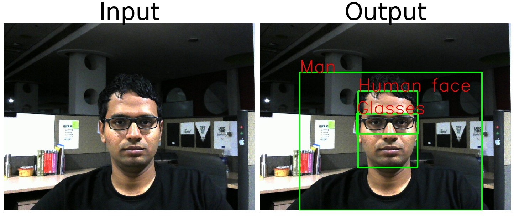

# TensorFlow Hub Module Samples
This repository is a demonstration of usage of different types of TensorFlow Hub modules integrated with Datasets, Iterators and Saved_Models. Several of the modules, I have demoed with different types of online contest problems. For more explanation on these modules, please refer to my [Medium post](https://medium.com/ymedialabs-innovation/how-to-use-tensorflow-hub-with-code-examples-9100edec29af).

---

## [Image Classification Module](ImageClassification)
This is a demonstration of image classification performed using Inception V3 classification module. No training has been performed in this sample and direct inference obtained using Inception V3 model trained on ImageNet 1000 classes is used.

This is the output generated on few of the images.

## [Feature Vector Module](FeatureVector)
This is a demonstration of fine-tuning the ResNet 50 V2 feature vector module to predict in a multi-label classification problem. The final layers of the model has been fine-tuned along with the customly appended dense layers.

## [Video Classification Module](VideoClassification)
This is a demonstration of video classification performed using Inception 3D module. 

This is the sample output result of performing inference on the trained module.

## [Text Embedding Module](TextEmbeddings)
Text embeddings can be performed at individual word level present inside the sentence or can be performed at the entire sentence level. In this example, both types of embeddings i.e at word level and at sentence level has been used on sentiment analysis problem. In both the approaches, Elmo embeddings have been made use of.

## [Image Augmentation Module](ImageAugmentation)
Training is not possible on Image Augmentation modules as they contain no variables.

#### Direct Images
This is a demonstration of making use of Image Augmentation module performing directly on decoded image data. The AutoAugment algorithm Module has been used in this example. 

This is how the likely augmented images will look like:

#### Clubbed Modules
This is a demonstration of making use of Image Augmentation module paired with other TF-Hub modules. Also, it demonstrates how to perform augmentations on encoded images.The Crop-Color Image Augmentation Module has been used in this example. The images generated from this module is passed into Resnet 50 V2 Feature Vector module which will be trained on multi-label classification problem.

## [Object Detection Module](ObjectDetection)

There is no training performed in this module. FasterRCNN on Inception-ResNet V2 module has been used to generate bounding boxes.

This is the sample output from this module.

## [Generator Module](Generators)

There is no training performed in this module. Progressive GANs module has been used to generate images.

This is the sample of images you are likely to get.

